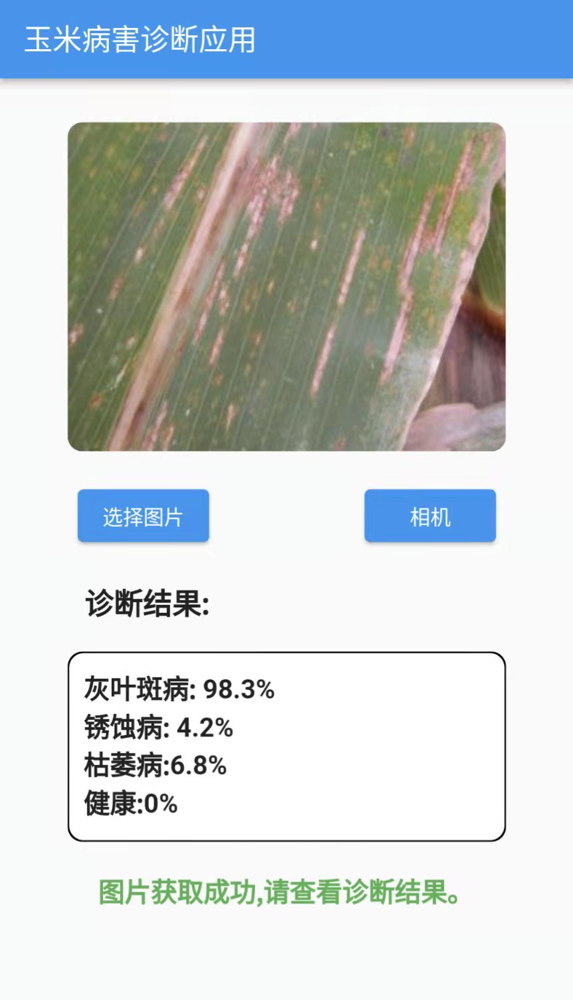

# corn_disease_recognation

#### 使用TensorFlow Lite将深度学习模型转化后开发玉米病害图像识别应用。

1. 使用相机拍照或者选择本地相册的图像进行识别
2. 对图像进行预处理以符合模型的图像输入大小
3. 使用AndroidX Camera库操作相机
4. 使用TensorFlow Lite中ImageProcessor将Bitmap处理为TensorImage，BaseOptions设置线程来加速模型的计算

